<a id="top"></a>
<div align="center">

# 🗄️ Database Management Systems (DBMS)

### *A Complete, Deep-Dive Semester Repository — Theory + Lab + Practice*


<br>


<br><br>


<br><br>


</div>

---

## 📖 Table of Contents

<details open>
<summary><b>Click to expand / collapse</b></summary>

- [🎓 University & Instructor Info](#university-info)
- [📋 Course & Lab Info](#course-info)
- [📂 Repository Structure](#repo-structure)
- [📖 About This Repository](#about)
- [💡 Why This Course Matters](#why-matters)
- [📚 Reference Books](#books)
- [🎯 Course Learning Outcomes (CLOs)](#clos)
- [📊 Assessment Plan (Detailed CLO Mapping)](#assessment)
- [🗓️ Semester Roadmap (Gantt + Weekly)](#roadmap)
- [🧭 Full 32-Lecture Breakdown](#lecture-breakdown)
- [🗂️ Full Theory Syllabus Explained (Unit by Unit)](#syllabus)
- [🧪 Full Lab Manual Explained (with SQL Examples)](#labs)
- [🏗️ Mini Project — Library Management System](#miniproject)
- [🔑 Key Concepts — Deep Dive](#concepts)
- [📘 Glossary of Key Terms](#glossary)
- [⚡ SQL & PL/SQL Cheat Sheet](#cheatsheet)
- [🌍 Real-World DBMS Usage](#realworld)
- [❓ Common Interview & Viva Questions](#interview)
- [🏆 Tips for Scoring Well](#tips)
- [🧭 How to Use This Repository](#howto)
- [🙋 FAQ](#faq)
- [🛠 Technologies & Concepts Covered](#tech)
- [👨‍💻 Author](#author)
- [📜 License](#license)
- [🙏 Acknowledgements](#ack)

</details>

---

<a id="university-info"></a>
## 🎓 University & Instructor Info

| Item | Details |
|------|---------|
| 🏫 University | University of the Punjab |
| 🏛 Department | Punjab University College of Information Technology (PUCIT) |
| 📚 Subject | Database Management Systems |
| 👨‍🏫 Instructor | Sir Asif |
| 🗓 Semester | 3rd Semester — Fall 2025 |
| 🎯 Degree Program | BS Information Technology |
| 📍 Campus | New Campus, Lahore, Pakistan |

<div align="right"><a href="#top">⬆️ Back to Top</a></div>

---

<a id="course-info"></a>
## 📋 Course & Lab Info

| Attribute | Theory — CC-215 | Lab — CC-215-L |
|-----------|-----------------|-----------------|
| Course Title | Database Systems | Database Systems Lab |
| Credit Hours | 3 (3,0) | 1 (0,3) |
| Category | Computing Core | Computing Core |
| Prerequisite | None | None |
| Co-Requisite | None | None |
| Follow-up Course | DI-324: Database Administration and Management | DI-324: Database Administration and Management |
| Delivery Mode | Lecture-based, 32 lectures | Hands-on lab, 16 sessions |
| Software Used | Oracle Database / MS SQL Server | Oracle Database / MS SQL Server |

<div align="right"><a href="#top">⬆️ Back to Top</a></div>

---

<a id="repo-structure"></a>
## 📂 Repository Structure

```
📦 DBMS-Semester-3-Sir-Asif
 ┣ 📁 Books
 ┃ ┣ 📘 Database Systems - Design, Implementation & Management — Coronel & Morris (13th Ed.)
 ┃ ┣ 📗 Database Systems - A Practical Approach to Design, Implementation & Management — Connolly & Begg (6th Ed.)
 ┃ ┗ 📙 Modern Database Management — Hoffer, Venkataraman & Topi (12th Ed.)
 ┃
 ┣ 📁 Course Description
 ┃ ┗ 📄 CC-215 Database Systems — Official Course Outline
 ┃
 ┣ 📁 Labs Description
 ┃ ┗ 📄 CC-215-L Database Systems Lab — Official Lab Outline
 ┃
 ┣ 📁 Lecture Slides
 ┃ ┣ 🖥️ Unit 1  — Introduction (Fall 2024)
 ┃ ┣ 🖥️ Unit 2  — Database Architecture & Components (F24)
 ┃ ┣ 🖥️ Unit 3  — Data Models (F25)
 ┃ ┣ 🖥️ Unit 4  — Relational Data Model (F25)
 ┃ ┣ 🖥️ Unit 5  — Relational Algebra (F25)
 ┃ ┣ 🖥️ Unit 6  — Entity Relationship Model (F25)
 ┃ ┣ 🖥️ Unit 7  — Extended ER Model (F25)
 ┃ ┣ 🖥️ Unit 8  — Transforming ERD into Relations (F25)
 ┃ ┣ 🖥️ Unit 9  — Functional Dependencies & Inference Rules (F25)
 ┃ ┣ 🖥️ Unit 10 — Normalization (F25)
 ┃ ┣ 🖥️ Unit 11 — Database Design (F25)
 ┃ ┣ 🖥️ Unit 12 — Transaction Processing (F25)
 ┃ ┗ 🖥️ Unit 13 — Concurrency Control (F25)
 ┃
 ┗ 📁 Labs Data
   ┣ 📄 DBMS Lab Manual
   ┣ 💻 SQL-1  — Introduction
   ┣ 💻 SQL-2  — SELECT Statement
   ┣ 💻 SQL-3  — Functions (F25)
   ┣ 💻 SQL-4  — Group & Analytic Functions (F25)
   ┣ 💻 SQL-5  — Joins (F25)
   ┣ 💻 SQL-6  — Subquery (F25)
   ┣ 💻 SQL-7  — DDL (F25)
   ┣ 💻 SQL-8  — DDL Continued (F25)
   ┣ 💻 SQL-9  — Database Objects (F25)
   ┣ 💻 SQL-10 — DCL (F25)
   ┣ ⚙️ PL/SQL-1 (F25)
   ┗ ⚙️ PL/SQL-2 (F25)
```

<div align="right"><a href="#top">⬆️ Back to Top</a></div>

---

<a id="about"></a>
## 📖 About This Repository

> This repository is a complete, organized archive of my **3rd Semester Database Management Systems (CC-215 / CC-215-L)** course, taught by **Sir Asif** at **PUCIT, University of the Punjab**.

It brings together everything from the semester in one place, and goes further than a simple file dump — it's a **study companion**:

- 📚 All **reference textbooks**, with a guide on which one to open for which topic
- 📄 Official **course & lab outlines**, fully explained in plain English
- 🖥️ Every **lecture slide deck** (Units 1–13), summarized concept by concept
- 💻 The complete **SQL & PL/SQL lab manual**, with runnable example queries
- 🏗️ A **worked mini-project** connecting ER modeling → normalization → SQL → PL/SQL end to end
- ❓ A bank of **interview & viva questions** for exam prep
- ⚡ A **cheat sheet** for fast syntax lookup the night before a quiz

The goal is simple: turn scattered PDFs and slide decks into one place I can actually revise from — before quizzes, before the midterm, before the final, and later, before interviews.

<div align="right"><a href="#top">⬆️ Back to Top</a></div>

---

<a id="why-matters"></a>
## 💡 Why This Course Matters

Every app on your phone is, underneath, a conversation with a database.

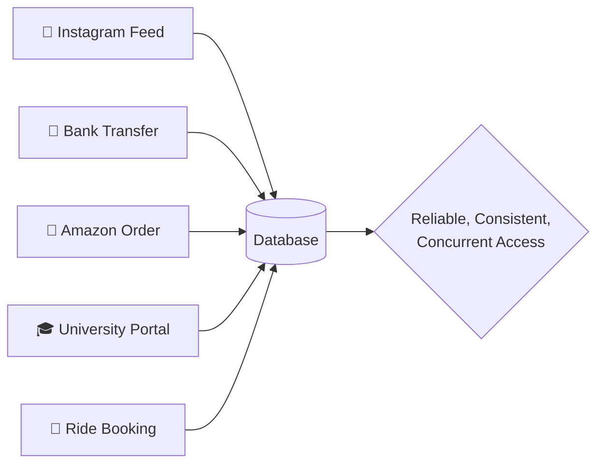

Whether it's a ride-hailing app matching a driver in milliseconds, a bank making sure money doesn't vanish mid-transfer, or a university portal showing the right grades to the right student — it all comes back to the same ideas covered in this repo: **modeling data correctly, querying it efficiently, and keeping it consistent under pressure.**

<div align="right"><a href="#top">⬆️ Back to Top</a></div>

---

<a id="books"></a>
## 📚 Reference Books

| # | Book | Author(s) | Edition | ISBN |
|---|------|-----------|---------|------|
| 1️⃣ | Database Systems — Design, Implementation & Management | Carlos Coronel, Steven Morris | 13th Edition | 978-1-337-62790-0 |
| 2️⃣ | Database Systems: A Practical Approach to Design, Implementation & Management | Thomas Connolly, Carolyn Begg | 6th Edition | 1292061189 |
| 3️⃣ | Modern Database Management | Jeffrey A. Hoffer, Ramesh Venkataraman, Heikki Topi | 12th Edition (Pearson, 2015) | 0133544613 |

<p align="center">


</p>

### 📖 Which Book Should I Open For What? (Coverage Matrix)

| Topic | Coronel & Morris | Connolly & Begg | Hoffer et al. |
|-------|:---:|:---:|:---:|
| Database Fundamentals | ✅ Best | ✅ | ✅ |
| ER / EER Modeling | ✅ Best | ✅ | ✅ |
| Relational Algebra | ⚪ | ✅ Best | ⚪ |
| SQL & PL/SQL | ✅ | ✅ | ⚪ |
| Normalization | ✅ Best | ✅ | ✅ |
| Transaction Management | ✅ | ✅ | ⚪ |
| Concurrency Control | ✅ | ✅ Best | ⚪ |
| Distributed Databases | ⚪ | ✅ Best | ⚪ |
| Business/Case-Study Framing | ⚪ | ⚪ | ✅ Best |

### 📖 What Each Book Is Best For

| Book | Best Used For |
|------|----------------|
| Coronel & Morris | Core theory, ER modeling, normalization walkthroughs, end-of-chapter practice problems |
| Connolly & Begg | Deep dives into relational algebra, distributed databases, and database design methodology |
| Hoffer, Venkataraman & Topi | Business-oriented explanations, real organizational case studies, data modeling for management |

<div align="right"><a href="#top">⬆️ Back to Top</a></div>

---

<a id="clos"></a>
## 🎯 Course Learning Outcomes (CLOs)

### 📘 Theory (CC-215)

| CLO | Outcome | Bloom's Taxonomy | Mapped PLOs |
|-----|---------|-------------------|--------------|
| CLO1 | Understand and explain fundamental database concepts | C2 – Understand | PLO 1, 2 |
| CLO2 | Analyze and design conceptual, logical, and physical database schemas using different data models | C4 – Analysis | PLO 2, 3, 4, 5 |
| CLO3 | Learn SQL and the fundamentals of PL/SQL | C3 – Apply | PLO 2, 3, 4, 5 |
| CLO4 | Design and evaluate a database system for small business organizations | C6 – Create | PLO 2, 3, 4, 5, 6, 7, 10 |

### 🧪 Lab (CC-215-L)

| CLO | Outcome | Bloom's Taxonomy | Mapped PLOs |
|-----|---------|-------------------|--------------|
| CLO1 | Build a basic understanding of SQL commands and PL/SQL fundamentals | C2 – Understand | PLO 1, 2 |
| CLO2 | Write queries as per given requirements | C3 – Apply | PLO 3, 4, 5 |
| CLO3 | Evaluate query processing | C5 – Evaluate | PLO 3, 4, 5, 7 |

<div align="right"><a href="#top">⬆️ Back to Top</a></div>

---

<a id="assessment"></a>
## 📊 Assessment Plan (Detailed CLO Mapping)

### 🎡 Theory Weightage — 100 Marks

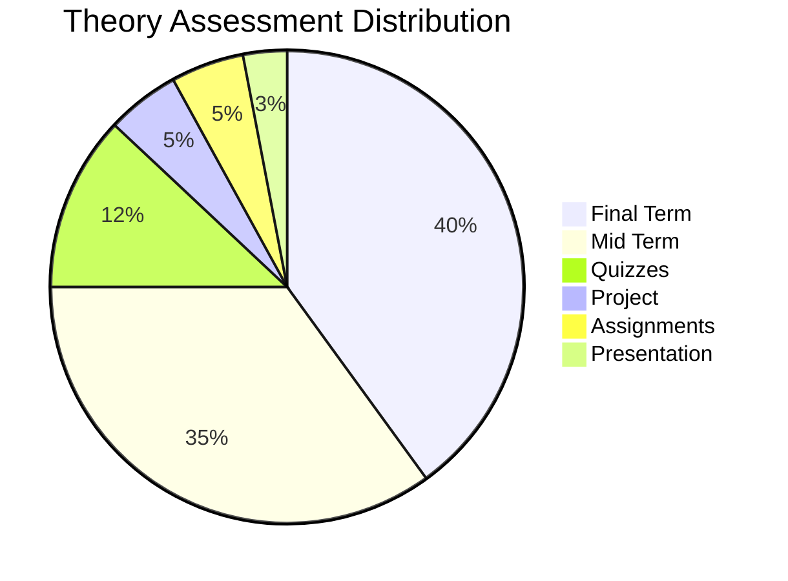

| Criteria | Marks | CLO1 | CLO2 | CLO3 | CLO4 |
|----------|:-----:|:----:|:----:|:----:|:----:|
| Quizzes | 12 | 4 | 4 | 4 | 0 |
| Assignments | 5 | 0 | 4 | 0 | 1 |
| Presentation | 3 | 1 | 1 | 1 | 0 |
| Project | 5 | 0 | 1 | 0 | 4 |
| Mid Term | 35 | 10 | 10 | 15 | 0 |
| Final Term | 40 | 10 | 5 | 15 | 10 |
| **Total** | **100** | **25** | **25** | **35** | **15** |

### 🎡 Lab Weightage — 100 Marks

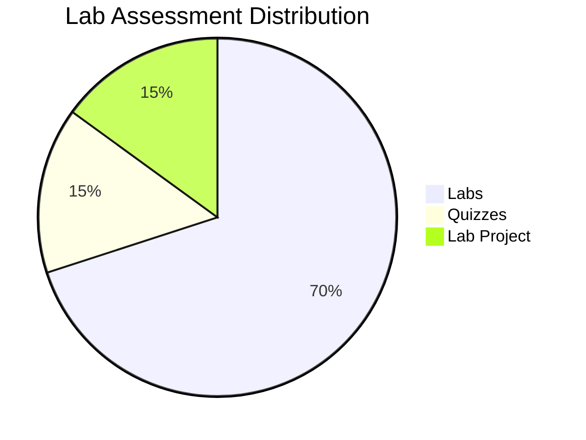

| Criteria | Marks | CLO1 | CLO2 | CLO3 |
|----------|:-----:|:----:|:----:|:----:|
| Labs | 70 | 30 | 30 | 10 |
| Quizzes | 15 | 10 | 5 | 0 |
| Lab Project | 15 | 5 | 10 | 0 |
| **Total** | **100** | **45** | **45** | **10** |

> 💡 **Reading this table**: Notice how CLO3 (SQL/PL-SQL fundamentals) is weighted heavily in quizzes and labs, while CLO4 (designing a full database system) is almost entirely assessed through the **Project** and **Final Term** — a strong hint that project work and final-exam design questions deserve extra prep time.

<div align="right"><a href="#top">⬆️ Back to Top</a></div>

---

<a id="roadmap"></a>
## 🗓️ Semester Roadmap

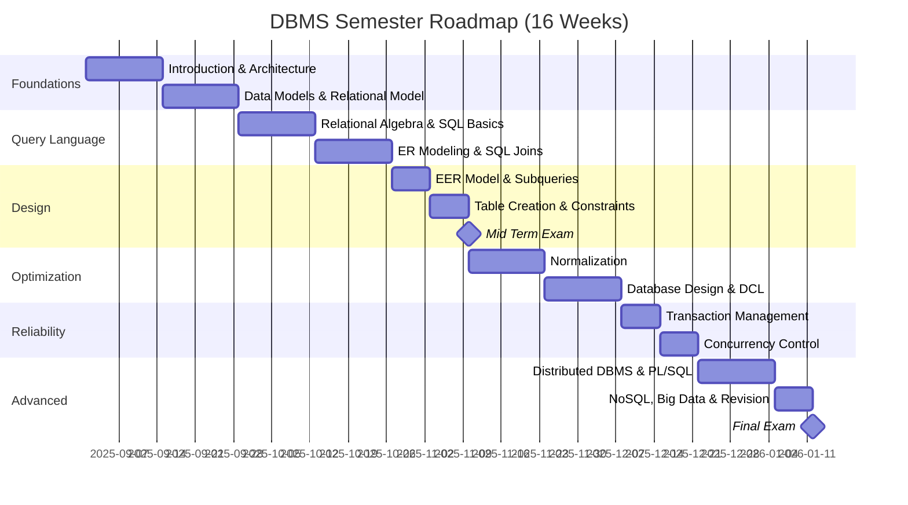

### 🎢 A Student's Journey Through the Semester

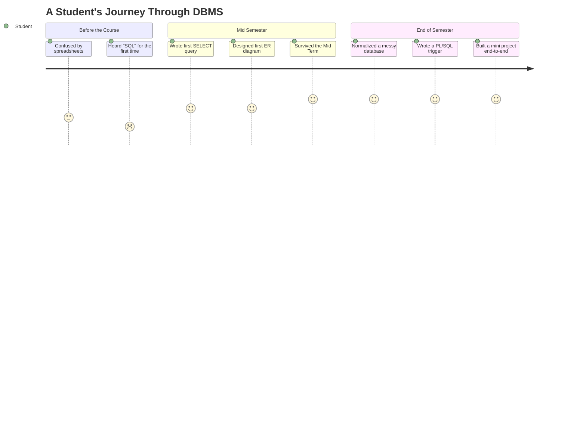

<div align="right"><a href="#top">⬆️ Back to Top</a></div>

---

<a id="lecture-breakdown"></a>
## 🧭 Full 32-Lecture Breakdown

<details>
<summary><b>📌 Click to expand the complete lecture-by-lecture schedule</b></summary>

| Week | Lec # | Topic | Deliverable / Activity |
|:----:|:-----:|-------|--------------------------|
| 1 | 1 | Data vs. Information, File Processing vs. Database Systems, Advantages of DBMS, Types of Databases | Books Reading |
| 2 | 2 | SQL Introduction, SELECT statement, Arithmetic operators, Relational & Logical operators | Lab Exercises |
| 2 | 3 | Database Architecture: 3-Level Schema, Data Independence, DB Environment Components, DBMS Functions, User Roles | Books Reading, Homework, Term Project Initiated |
| 3 | 4 | SELECT special operators (BETWEEN, IN, LIKE, IS NULL), DISTINCT, Column Alias, ORDER BY; NVL/NVL2/NULLIF | Lab Exercises |
| 3 | 5 | Database Development Process, DB Life Cycle, Building Blocks of Data Models (Entities, Attributes, Relationships, Constraints) | Quiz #1, 1-Page Project Proposal Due |
| 4 | 6 | Single-row SQL Functions: Character, Number, Date; Type Conversion Functions | Lab Exercises |
| 4 | 7 | Logical Data Models (Hierarchical, Network, Relational), Relational Keys, Entity & Referential Integrity | Books Reading, Homework |
| 5 | 8 | Relational Algebra Operators; DECODE, CASE, Group Functions, GROUP BY, HAVING, Analytic Functions | Lab Exercises, Assignment #1 |
| 5 | 9 | ER Modeling: Notations, Connectivity/Cardinality, Relationship Strength, Participation, Degree | Quiz #2, Books Reading, Lab Exercises |
| 6 | 10 | SQL Joins: Cartesian, Inner/Equi, Outer (Left/Right/Full), Non-Equi, Self Join | Preliminary Term Project Report Due |
| 6 | 11 | ER Model: Multivalued Attributes, Composite Entities, Developing ER Diagrams (Worked Examples) | Lab: SQL DML & Complex Queries Practice |
| 7 | 12 | Subqueries | Lab Exercises |
| 7 | 13 | Enhanced ER Model: Entity Super/Subtypes, Notation Comparison | Case Studies — Tiny College & Pine Valley Furniture Co. |
| 8 | 14 | Creating Database Tables, Table & Column Level Constraints | Assignment #1 Due, ER Model of Project Due |
| 8 | 15 | Transforming ERD into DB Structure — Mapping Rules | Quiz #3 |
| 8 | 16 | Data Manipulation (INSERT/UPDATE/DELETE); Revision | **Mid Term Exam** |
| 9 | 17 | Normalization: Need, Functional Dependencies, Armstrong's Axioms | Books Reading |
| 9 | 18 | Database Objects: Views, Indexes, Sequences, Synonyms | — |
| 10 | 19 | Normalization: 1NF, 2NF, 3NF | Books Reading, Revised ER Model Due |
| 10 | 20 | Controlling User Rights & Access (DCL): Roles, Privileges, GRANT, REVOKE | Assignment #2 |
| 11 | 21 | Higher Normal Forms: BCNF, 4NF, 5NF | Quiz #4 |
| 11 | 22 | Database Design: Top-Down vs. Bottom-Up, Design Phases | Books Reading |
| 12 | 23 | Transaction Management: Properties, SQL Transaction Handling, Buffer & Recovery Management | Assignment #2 Due, Presentations |
| 12 | 24 | Procedural SQL: PL/SQL Basics | Presentations |
| 13 | 25 | Concurrency Problems: Lost Updates, Uncommitted Data, Inconsistent Retrievals, Dirty Data | Books Reading, Quiz #5, Assignment #3 |
| 13 | 26 | PL/SQL: Selection, Repetition, Exception Handling, Cursors | — |
| 14 | 27 | Concurrency Control: Locking, Granularity, Lock Types, 2PL, Deadlocks, Timestamping | Books Reading |
| 14 | 28 | PL/SQL: Functions & Stored Procedures | — |
| 15 | 29 | Distributed Databases: Types, Advantages/Disadvantages, DDBMS Components | Term Project Submission |
| 15 | 30 | PL/SQL: Database Triggers | Quiz #6, Assignment #3 Due |
| 16 | 31 | Big Data & NoSQL, Data Quality and Data Integration | Books Reading |
| 16 | 32 | Future Trends, Full Revision | Final Exam Preparation |

</details>

<div align="right"><a href="#top">⬆️ Back to Top</a></div>

---

<a id="syllabus"></a>
## 🗂️ Full Theory Syllabus Explained (Unit by Unit)

### 1️⃣ Introduction to Databases

Covers the difference between **raw data** and **information**, why file-processing systems (flat files managed directly by applications) run into redundancy and consistency problems, and how a **DBMS** solves this by centralizing data management.

| File Processing System | Database System |
|---|---|
| Data scattered across separate files | Centralized, shared data store |
| High redundancy | Redundancy controlled |
| Program-data dependence | Program-data independence |
| Difficult concurrent access | Built-in concurrency control |
| Little to no security layer | Access control & user privileges |

### 2️⃣ Database Architecture & Components

Introduces the **ANSI-SPARC Three-Level Architecture** — the standard way a DBMS separates *how users see data* from *how it's actually stored*.

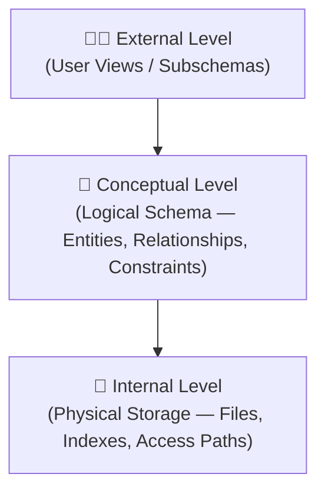

Also covers **data independence** (logical & physical), the components of a database environment (hardware, software, data, procedures, people), and the different roles of database users — DBA, application programmers, and end users.

### 3️⃣ Data Models

Explains the three stages a real-world requirement passes through before it becomes a working database:

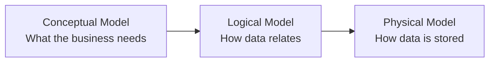

### 4️⃣ Relational Data Model

Core vocabulary of relational databases: **relations (tables)**, **tuples (rows)**, **attributes (columns)**, and **domains**.

| Key Type | Purpose |
|----------|---------|
| Super Key | Any attribute set that uniquely identifies a tuple |
| Candidate Key | A minimal super key |
| Primary Key | The chosen candidate key for the table |
| Foreign Key | An attribute referencing another table's primary key |
| Composite Key | A key made of more than one attribute |

Also covers **integrity constraints** — Entity Integrity (no null primary keys) and Referential Integrity (foreign keys must match an existing primary key or be null).

### 5️⃣ Relational Algebra

The formal, mathematical query language behind SQL.

| Operator | Symbol | What It Does |
|----------|:------:|----------------|
| Selection | σ | Filters rows matching a condition |
| Projection | π | Filters/selects specific columns |
| Union | ∪ | Combines rows from two compatible relations |
| Set Difference | − | Rows in one relation but not another |
| Cartesian Product | × | Pairs every row of one relation with every row of another |
| Join | ⋈ | Combines related rows from two relations |

### 6️⃣ Structured Query Language (SQL)

The single biggest chunk of the course. SQL commands are grouped into five categories:

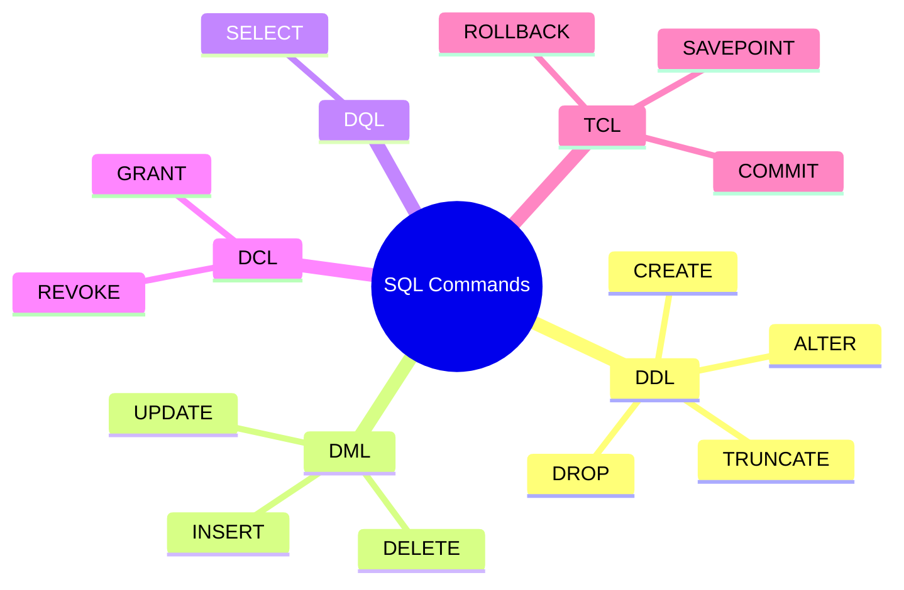

Also covers **single-row functions** (character, number, date, conversion), **group/analytic functions** (SUM, AVG, COUNT, ROLLUP, CUBE), all **join types**, **subqueries**, and database objects — **Views, Indexes, Sequences, Synonyms**.

### 7️⃣ Entity Relationship (ER) Model

The blueprint stage of database design. Covers entities, attribute types (simple, composite, multivalued, derived), relationships, **cardinality** (1:1, 1:M, M:N), **participation** (total vs. partial), and the **degree** of a relationship (unary, binary, ternary).

| Symbol Concept | Represents |
|-----------------|-----------|
| Rectangle | Entity |
| Oval | Attribute |
| Diamond | Relationship |
| Double Oval | Multivalued Attribute |
| Dashed Oval | Derived Attribute |
| Double Rectangle | Weak Entity |

### 8️⃣ Enhanced Entity Relationship (EER) Model

Extends basic ER modeling with **specialization and generalization** — modeling entity supertypes and subtypes (e.g., an `Employee` entity specialized into `Manager` and `Technician`), similar to inheritance in programming.

### 9️⃣ Transforming ERD into Relational Schema

The rulebook for converting an ER diagram into actual database tables — how 1:1, 1:M, and M:N relationships each become foreign keys or junction tables, and how multivalued/composite attributes get flattened into separate columns or tables.

### 🔟 Functional Dependencies & Normalization

A **functional dependency** (X → Y) means the value of X determines the value of Y. **Armstrong's Axioms** — Reflexivity, Augmentation, Transitivity — are the formal inference rules used to derive all dependencies in a relation, forming the mathematical foundation for normalization.

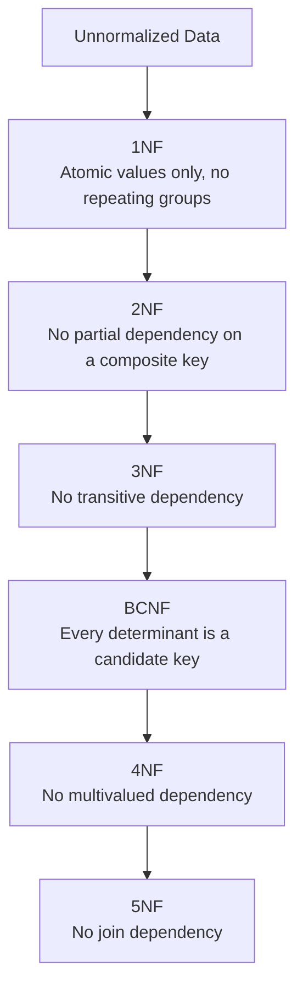

Normalization exists to eliminate **insertion, update, and deletion anomalies** caused by redundant data. See the [worked normalization example](#concepts) below for a concrete before/after table.

### 1️⃣1️⃣ Database Design

Compares **top-down design** (start broad, refine into detail) with **bottom-up design** (start with individual attributes, group them into entities), and walks through the three design phases — conceptual, logical, physical — plus strategies for improving performance (indexing, selective denormalization).

### 1️⃣2️⃣ Transaction Management

A **transaction** is a single logical unit of work that must complete entirely or not at all. Governed by the **ACID** properties:

| Property | Meaning |
|----------|---------|
| **A**tomicity | All operations succeed, or none do |
| **C**onsistency | The database moves from one valid state to another |
| **I**solation | Concurrent transactions don't interfere with each other |
| **D**urability | Once committed, changes survive system failure |

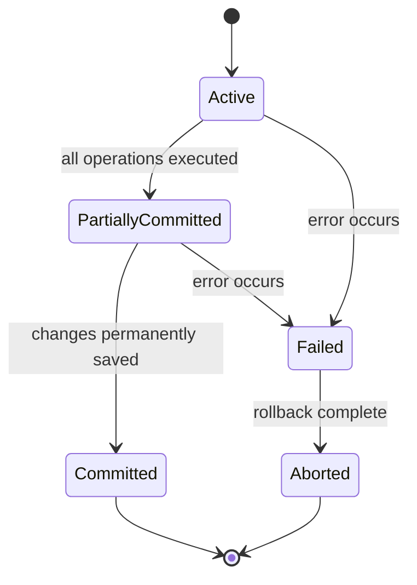

Here's what a transaction actually looks like moving through the system, using a simple bank transfer:

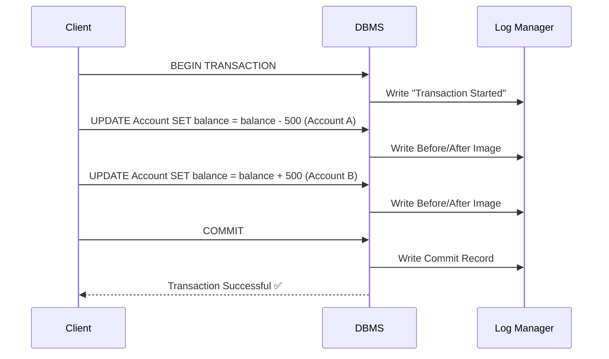

Also covers **recovery techniques** for restoring a consistent database state after failure (log-based recovery, checkpoints).

### 1️⃣3️⃣ Concurrency Control

Addresses what goes wrong when multiple transactions run at the same time.

| Problem | What Happens |
|---------|--------------|
| Lost Update | Two transactions overwrite each other's changes |
| Dirty Read | Reading uncommitted data from another transaction |
| Inconsistent Retrieval | Reading data mid-update, getting a partial/inconsistent view |

Solved using **locking** (shared vs. exclusive locks, two-phase locking), **timestamp ordering**, and **deadlock** detection/prevention.

### 1️⃣4️⃣ Distributed DBMS

A database spread across multiple physical sites that behaves like a single system. Covers the components of a DDBMS and the **transparency features** that hide the distribution from users — location transparency, fragmentation transparency, and replication transparency.

### 1️⃣5️⃣ Advancements: NoSQL, Big Data & Future Trends

Introduces **NoSQL** database categories as an alternative to relational databases for large-scale, flexible-schema data:

| NoSQL Type | Example Use Case |
|------------|-------------------|
| Document Store | Storing JSON-like flexible records (e.g., user profiles) |
| Key-Value Store | Ultra-fast lookups (e.g., caching, sessions) |
| Column-Family Store | Massive write-heavy workloads (e.g., analytics logs) |
| Graph Database | Highly connected data (e.g., social networks) |

Plus a look at **data quality** and **data integration** challenges in modern systems.

### 1️⃣6️⃣ Procedural SQL (PL/SQL)

Oracle's procedural extension to SQL, covering the structure of a **PL/SQL block** (`DECLARE` / `BEGIN` / `EXCEPTION` / `END`), variables, control structures (`IF`, loops), **cursors**, **stored procedures and functions**, and **database triggers**.

<div align="right"><a href="#top">⬆️ Back to Top</a></div>

---

<a id="labs"></a>
## 🧪 Full Lab Manual Explained (with SQL Examples)

The lab component (CC-215-L) is entirely hands-on SQL and PL/SQL practice, building up from basic queries to full procedural programming.

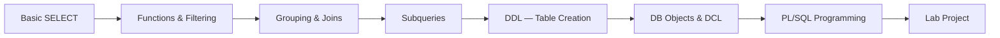

| Lab | Milestone | Topics Covered |
|:---:|:---------:|------------------|
| **Lab 1** | — | Installing Oracle/SQL Server, running your first SQL statements |
| **Lab 2** | — | Data retrieval, WHERE clause, arithmetic/relational/logical operators |
| **Lab 3** | — | `BETWEEN`, `IN`, `LIKE`, `IS NULL`, `DISTINCT`, `ORDER BY` |
| **Lab 4** | Quiz #1 | Single-row functions, `NVL`, character functions |
| **Lab 5** | — | Number & date functions, type conversion functions |
| **Lab 6** | — | `DECODE`/`CASE`, group functions, `GROUP BY`, `HAVING` |
| **Lab 7** | Quiz #2 | Revision, `ROLLUP`/`CUBE`, intro to SQL joins |
| **Lab 8** | — | All join types: Cartesian, Equi/Inner, Outer, Non-Equi, Self |
| **Lab 9** | — | Subqueries: single-row, multi-row, correlated, `IN`/`ANY`/`ALL` |
| **Lab 10** | Quiz #3 | DDL: `CREATE`, constraints, `ALTER`, `DROP`, `TRUNCATE`, `RENAME` |
| **Lab 11** | — | DML, table creation via subquery, Views, Indexes, Sequences, Synonyms |
| **Lab 12** | Quiz #4 | DCL: roles, privileges, creating users, `GRANT`/`REVOKE` |
| **Lab 13** | Lab Project Starts | PL/SQL block basics, variable declaration, `SELECT` inside PL/SQL |
| **Lab 14** | — | PL/SQL: selection, repetition, exception handling, cursors |
| **Lab 15** | — | PL/SQL: stored procedures, functions, intro to triggers |
| **Lab 16** | Lab Project Due | Database triggers, full revision |

### 💻 Example: SELECT + Filtering (Labs 2–3)

```sql
SELECT first_name, last_name, salary
FROM employees
WHERE salary BETWEEN 40000 AND 90000
  AND department_id IN (10, 20, 30)
  AND last_name LIKE 'A%'
ORDER BY salary DESC;
```

### 💻 Example: Group & Analytic Functions (Labs 4–6)

```sql
SELECT department_id,
       COUNT(*)          AS total_employees,
       AVG(salary)        AS avg_salary,
       RANK() OVER (ORDER BY AVG(salary) DESC) AS dept_rank
FROM employees
GROUP BY department_id
HAVING COUNT(*) > 3;
```

### 💻 Example: Joins (Labs 7–8)

```sql
SELECT e.first_name, d.department_name
FROM employees e
LEFT JOIN departments d
  ON e.department_id = d.department_id;
```

### 💻 Example: Correlated Subquery (Lab 9)

```sql
SELECT e.first_name, e.salary
FROM employees e
WHERE e.salary > (
    SELECT AVG(salary)
    FROM employees
    WHERE department_id = e.department_id
);
```

### 💻 Example: DDL with Constraints (Labs 10–11)

```sql
CREATE TABLE departments (
    department_id   NUMBER PRIMARY KEY,
    department_name VARCHAR2(50) NOT NULL UNIQUE
);

CREATE VIEW high_earners AS
SELECT first_name, last_name, salary
FROM employees
WHERE salary > 100000;

CREATE INDEX idx_emp_salary ON employees(salary);
```

### 💻 Example: DCL (Lab 12)

```sql
GRANT SELECT, INSERT ON employees TO junior_dev;
REVOKE INSERT ON employees FROM junior_dev;
```

### 💻 Example: PL/SQL Block with Cursor (Labs 13–14)

```sql
DECLARE
    CURSOR emp_cursor IS
        SELECT first_name, salary FROM employees WHERE department_id = 10;
    v_name   employees.first_name%TYPE;
    v_salary employees.salary%TYPE;
BEGIN
    OPEN emp_cursor;
    LOOP
        FETCH emp_cursor INTO v_name, v_salary;
        EXIT WHEN emp_cursor%NOTFOUND;
        DBMS_OUTPUT.PUT_LINE(v_name || ' earns ' || v_salary);
    END LOOP;
    CLOSE emp_cursor;
END;
/
```

### 💻 Example: Stored Procedure & Trigger (Labs 15–16)

```sql
CREATE OR REPLACE PROCEDURE give_raise (
    p_emp_id IN NUMBER,
    p_amount IN NUMBER
) AS
BEGIN
    UPDATE employees
    SET salary = salary + p_amount
    WHERE employee_id = p_emp_id;
    COMMIT;
END;
/

CREATE OR REPLACE TRIGGER trg_no_negative_salary
BEFORE UPDATE OF salary ON employees
FOR EACH ROW
WHEN (NEW.salary < 0)
BEGIN
    RAISE_APPLICATION_ERROR(-20001, 'Salary cannot be negative.');
END;
/
```

<div align="right"><a href="#top">⬆️ Back to Top</a></div>

---

<a id="miniproject"></a>
## 🏗️ Mini Project — Library Management System

<div align="center">

</div>

To make the whole semester click together, here's a small end-to-end system — a **Library Management System** — built the same way we're taught to: ER diagram → normalized schema → SQL → PL/SQL.

### 🧩 Step 1: ER Diagram

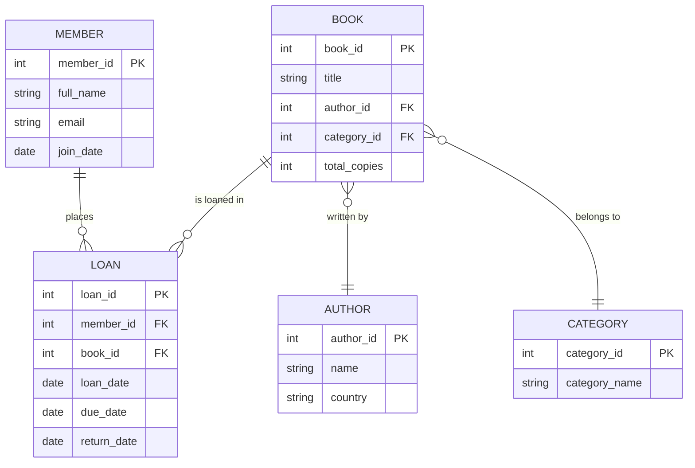

### 🧩 Step 2: Normalized Relational Schema (SQL DDL)

```sql
CREATE TABLE Author (
    author_id     NUMBER PRIMARY KEY,
    name          VARCHAR2(100) NOT NULL,
    country       VARCHAR2(50)
);

CREATE TABLE Category (
    category_id   NUMBER PRIMARY KEY,
    category_name VARCHAR2(50) NOT NULL
);

CREATE TABLE Book (
    book_id       NUMBER PRIMARY KEY,
    title         VARCHAR2(150) NOT NULL,
    author_id     NUMBER REFERENCES Author(author_id),
    category_id   NUMBER REFERENCES Category(category_id),
    total_copies  NUMBER DEFAULT 1 CHECK (total_copies >= 0)
);

CREATE TABLE Member (
    member_id     NUMBER PRIMARY KEY,
    full_name     VARCHAR2(100) NOT NULL,
    email         VARCHAR2(100) UNIQUE,
    join_date     DATE DEFAULT SYSDATE
);

CREATE TABLE Loan (
    loan_id       NUMBER PRIMARY KEY,
    member_id     NUMBER REFERENCES Member(member_id),
    book_id       NUMBER REFERENCES Book(book_id),
    loan_date     DATE DEFAULT SYSDATE,
    due_date      DATE,
    return_date   DATE
);

CREATE SEQUENCE loan_seq START WITH 1 INCREMENT BY 1;
```

### 🧩 Step 3: Real Queries Against This Schema

```sql
-- Every book currently overdue
SELECT m.full_name, b.title, l.due_date
FROM Loan l
JOIN Member m ON l.member_id = m.member_id
JOIN Book   b ON l.book_id   = b.book_id
WHERE l.return_date IS NULL
  AND l.due_date < SYSDATE;

-- Loans per category, busiest first
SELECT c.category_name, COUNT(*) AS total_loans
FROM Loan l
JOIN Book b     ON l.book_id = b.book_id
JOIN Category c ON b.category_id = c.category_id
GROUP BY c.category_name
ORDER BY total_loans DESC;
```

### 🧩 Step 4: Business Logic in PL/SQL

```sql
CREATE OR REPLACE PROCEDURE issue_book (
    p_member_id IN NUMBER,
    p_book_id   IN NUMBER
) AS
BEGIN
    INSERT INTO Loan (loan_id, member_id, book_id, loan_date, due_date)
    VALUES (loan_seq.NEXTVAL, p_member_id, p_book_id, SYSDATE, SYSDATE + 14);

    UPDATE Book
    SET total_copies = total_copies - 1
    WHERE book_id = p_book_id;

    COMMIT;
END;
/

CREATE OR REPLACE TRIGGER trg_prevent_negative_stock
BEFORE UPDATE OF total_copies ON Book
FOR EACH ROW
WHEN (NEW.total_copies < 0)
BEGIN
    RAISE_APPLICATION_ERROR(-20001, 'Book copies cannot go negative.');
END;
/
```

> 🎯 **Why this matters**: this tiny project touches ER modeling, keys & constraints, joins, aggregation, sequences, stored procedures, and triggers — basically the entire semester in miniature.

<div align="right"><a href="#top">⬆️ Back to Top</a></div>

---

<a id="concepts"></a>
## 🔑 Key Concepts — Deep Dive

### ⚖️ Types of SQL Joins

| Join Type | Returns |
|-----------|---------|
| Inner / Equi Join | Only matching rows from both tables |
| Left Outer Join | All rows from left table + matches from right |
| Right Outer Join | All rows from right table + matches from left |
| Full Outer Join | All rows from both, matched where possible |
| Self Join | A table joined with itself |
| Cartesian Join | Every row of one table paired with every row of the other |

### 🧮 Normalization — A Worked Example

**Before (Unnormalized):**

| OrderID | Customer | Products (repeating) |
|---------|----------|------------------------|
| 101 | Ali | Pen, Notebook, Eraser |

**After 1NF (atomic values, one row per product):**

| OrderID | Customer | Product |
|---------|----------|---------|
| 101 | Ali | Pen |
| 101 | Ali | Notebook |
| 101 | Ali | Eraser |

**After 3NF (split into separate, non-redundant relations):**

`Orders(OrderID, CustomerID)` · `Customers(CustomerID, Customer)` · `OrderItems(OrderID, ProductID)` · `Products(ProductID, ProductName)`

This removes the redundancy of repeating "Ali" for every product and eliminates update anomalies (renaming the customer once, not three times).

### 🔐 ACID Properties Recap

| Property | Guarantees | Real Example |
|----------|-----------|----------------|
| Atomicity | "All or nothing" execution | A failed bank transfer rolls back completely — no money vanishes |
| Consistency | Valid state → valid state | Account balances always sum correctly across the bank |
| Isolation | Transactions don't see each other's uncommitted work | Two people booking the last movie seat don't both succeed |
| Durability | Committed data survives crashes | Your paid order stays paid even if the server restarts |

### ⚠️ Concurrency Control Problems

| Problem | Description |
|---------|-------------|
| Lost Update | Two transactions overwrite each other's changes |
| Dirty Read | Reading uncommitted data from another transaction |
| Inconsistent Retrieval | Reading data mid-update, getting a partial/inconsistent view |

### 🏗️ Entity Relationship Notations

| Symbol Concept | Represents |
|-----------------|-----------|
| Rectangle | Entity |
| Oval | Attribute |
| Diamond | Relationship |
| Double Oval | Multivalued Attribute |
| Dashed Oval | Derived Attribute |
| Double Rectangle | Weak Entity |

### 📊 Topic Coverage in This Repository

| Topic | Coverage |
|---|---|
| SQL Fundamentals |  |
| ER & EER Modeling |  |
| Normalization |  |
| Transactions & Concurrency |  |
| PL/SQL Programming |  |
| Distributed DB & NoSQL |  |

<div align="right"><a href="#top">⬆️ Back to Top</a></div>

---

<a id="glossary"></a>
## 📘 Glossary of Key Terms

<details>
<summary><b>📌 Click to expand the full A–Z glossary (40+ terms)</b></summary>

| Term | Definition |
|------|-------------|
| **ACID** | Atomicity, Consistency, Isolation, Durability — the four guarantees of a reliable transaction |
| **Aggregate Function** | A function operating on a group of rows to return a single value (e.g., `SUM`, `AVG`) |
| **Anomaly** | An unwanted side effect of redundant data — insertion, update, or deletion anomalies |
| **Armstrong's Axioms** | Formal inference rules (reflexivity, augmentation, transitivity) used to derive functional dependencies |
| **Attribute** | A property or characteristic of an entity (becomes a column in a table) |
| **BCNF** | Boyce-Codd Normal Form — every determinant in the relation must be a candidate key |
| **Candidate Key** | A minimal set of attributes that can uniquely identify a row |
| **Cardinality** | The numeric nature of a relationship — 1:1, 1:M, or M:N |
| **Cartesian Product** | Pairing every row of one table with every row of another |
| **Cursor** | A pointer used in PL/SQL to process query results row by row |
| **DBA** | Database Administrator — manages, secures, and maintains the database |
| **DCL** | Data Control Language — commands like `GRANT`/`REVOKE` that manage access |
| **Deadlock** | Two or more transactions waiting on each other's locks indefinitely |
| **Degree (of Relationship)** | The number of entities participating in a relationship (unary, binary, ternary) |
| **Denormalization** | Deliberately introducing redundancy to improve read performance |
| **DDL** | Data Definition Language — commands like `CREATE`, `ALTER`, `DROP` |
| **Dirty Read** | Reading data that has been modified but not yet committed |
| **DML** | Data Manipulation Language — commands like `INSERT`, `UPDATE`, `DELETE` |
| **Entity** | A real-world object or concept represented in the database |
| **ER Diagram** | Visual blueprint of entities, attributes, and relationships |
| **Foreign Key** | An attribute referencing the primary key of another table |
| **Functional Dependency** | A relationship where one attribute's value determines another's |
| **Index** | A structure that speeds up data retrieval on a column |
| **Isolation Level** | How strictly transactions are kept independent from one another |
| **Join** | Combining rows from two or more tables based on a related column |
| **Lock** | A mechanism preventing simultaneous conflicting access to data |
| **Materialized View** | A view whose result set is physically stored for faster access |
| **Multivalued Attribute** | An attribute that can hold more than one value for a single entity |
| **Normalization** | The process of organizing data to reduce redundancy and anomalies |
| **NoSQL** | Non-relational databases designed for flexible schemas and horizontal scale |
| **PL/SQL** | Oracle's procedural extension to SQL for writing blocks, procedures, and triggers |
| **Primary Key** | The chosen unique identifier column(s) for a table |
| **Referential Integrity** | Rule ensuring foreign key values always match an existing primary key (or are null) |
| **Relation** | The formal term for a table in the relational model |
| **Schema** | The overall structure/blueprint of a database |
| **Sequence** | A database object that auto-generates unique numeric values |
| **Stored Procedure** | A saved, reusable block of PL/SQL code performing a task |
| **Subquery** | A query nested inside another query |
| **Synonym** | An alternate name for a database object |
| **Transaction** | A single logical unit of work that must fully succeed or fully fail |
| **Trigger** | Code that automatically executes in response to a table event |
| **Tuple** | A single row in a relation |
| **View** | A virtual table based on the result of a stored query |
| **Two-Phase Locking (2PL)** | A concurrency protocol with a growing phase (acquiring locks) and shrinking phase (releasing locks) |

</details>

<div align="right"><a href="#top">⬆️ Back to Top</a></div>

---

<a id="cheatsheet"></a>
## ⚡ SQL & PL/SQL Cheat Sheet

<details open>
<summary><b>📌 Quick syntax reference — click to collapse</b></summary>

```sql
-- ═══════════════ SELECT BASICS ═══════════════
SELECT column1, column2
FROM table_name
WHERE condition
ORDER BY column1 [ASC|DESC];

-- ═══════════════ FILTERING ═══════════════
WHERE column BETWEEN val1 AND val2
WHERE column IN (val1, val2, val3)
WHERE column LIKE 'A%'
WHERE column IS NULL

-- ═══════════════ JOINS ═══════════════
SELECT a.col, b.col
FROM table_a a
JOIN table_b b ON a.id = b.a_id;          -- INNER JOIN
LEFT JOIN table_b b ON a.id = b.a_id;     -- LEFT OUTER JOIN
RIGHT JOIN table_b b ON a.id = b.a_id;    -- RIGHT OUTER JOIN
FULL OUTER JOIN table_b b ON a.id = b.a_id;

-- ═══════════════ AGGREGATE & GROUP ═══════════════
SELECT department, COUNT(*), AVG(salary)
FROM employees
GROUP BY department
HAVING COUNT(*) > 5;

-- ═══════════════ SUBQUERY ═══════════════
SELECT name FROM employees
WHERE salary > (SELECT AVG(salary) FROM employees);

-- ═══════════════ DDL ═══════════════
CREATE TABLE table_name (
    col1 datatype PRIMARY KEY,
    col2 datatype NOT NULL,
    col3 datatype UNIQUE,
    col4 datatype CHECK (col4 > 0),
    col5 datatype REFERENCES other_table(col1)
);
ALTER TABLE table_name ADD column_name datatype;
DROP TABLE table_name;

-- ═══════════════ DCL ═══════════════
GRANT SELECT, INSERT ON table_name TO username;
REVOKE INSERT ON table_name FROM username;

-- ═══════════════ VIEWS, INDEX, SEQUENCE ═══════════════
CREATE VIEW view_name AS SELECT ... FROM ...;
CREATE INDEX idx_name ON table_name(column_name);
CREATE SEQUENCE seq_name START WITH 1 INCREMENT BY 1;

-- ═══════════════ PL/SQL BLOCK SKELETON ═══════════════
DECLARE
    v_var datatype;
BEGIN
    -- statements
EXCEPTION
    WHEN OTHERS THEN
        -- error handling
END;
/

-- ═══════════════ CURSOR SKELETON ═══════════════
DECLARE
    CURSOR c1 IS SELECT * FROM employees;
    v_row employees%ROWTYPE;
BEGIN
    OPEN c1;
    LOOP
        FETCH c1 INTO v_row;
        EXIT WHEN c1%NOTFOUND;
        -- process v_row
    END LOOP;
    CLOSE c1;
END;
/

-- ═══════════════ TRIGGER SKELETON ═══════════════
CREATE OR REPLACE TRIGGER trigger_name
BEFORE|AFTER INSERT|UPDATE|DELETE ON table_name
FOR EACH ROW
BEGIN
    -- trigger logic
END;
/
```

</details>

<div align="right"><a href="#top">⬆️ Back to Top</a></div>

---

<a id="realworld"></a>
## 🌍 Real-World DBMS Usage

| Platform | Database Technology (Widely Known For) | Why |
|----------|-------------------------------------------|-----|
| 🏦 Banks (general) | Oracle Database, IBM Db2 | Strict ACID guarantees for financial transactions |
| 📷 Instagram / Facebook | MySQL (heavily sharded), Cassandra | Relational for structured data, wide-column for feed-scale reads |
| 🎬 Netflix | Cassandra, MySQL | High availability across regions for streaming metadata |
| 🛒 Amazon | DynamoDB, Aurora, Oracle | NoSQL for catalog-scale reads, relational for order transactions |
| 🚕 Uber | PostgreSQL, MySQL, Cassandra | Trip data, geospatial queries, real-time matching |
| 🎓 University Portals | Oracle Database, MS SQL Server | Structured, relational student/course/grade data |

> ℹ️ Large companies often use **multiple database technologies together** (polyglot persistence) — a relational database for transactions that need ACID guarantees, and a NoSQL store for data that needs to scale horizontally.

<div align="right"><a href="#top">⬆️ Back to Top</a></div>

---

<a id="interview"></a>
## ❓ Common Interview & Viva Questions

<details>
<summary><b>🔹 SQL & Relational Model (6 Questions)</b></summary>
<br>

**Q: What is the difference between a Primary Key and a Unique Key?**
A Primary Key uniquely identifies each row, cannot contain NULL, and a table has only one. A Unique Key also enforces uniqueness but can accept a single NULL per column, and a table can have several.

**Q: What's the difference between WHERE and HAVING?**
`WHERE` filters individual rows before grouping; `HAVING` filters groups after `GROUP BY` has been applied.

**Q: What is a self join used for?**
Comparing rows within the same table — e.g., finding employees who report to the same manager.

**Q: What's the difference between DELETE, TRUNCATE, and DROP?**
`DELETE` removes rows (can be rolled back, fires triggers), `TRUNCATE` removes all rows instantly (minimal logging, can't be rolled back in most systems), `DROP` removes the entire table structure.

**Q: What is a correlated subquery?**
A subquery that references a column from the outer query, so it re-executes once per outer row.

**Q: What's the difference between a view and a materialized view?**
A view runs its query fresh every time it's accessed; a materialized view stores the result physically and needs to be refreshed.

</details>

<details>
<summary><b>🔹 ER Modeling & Normalization (6 Questions)</b></summary>
<br>

**Q: What's the difference between a strong and a weak entity?**
A strong entity has its own primary key; a weak entity depends on another entity's key for identification.

**Q: Why do we normalize a database?**
To reduce data redundancy and prevent insertion, update, and deletion anomalies.

**Q: What is a transitive dependency?**
When a non-key attribute depends on another non-key attribute, rather than directly on the primary key — this is what 3NF removes.

**Q: What's the difference between 3NF and BCNF?**
BCNF is stricter — it requires every determinant to be a candidate key, even in edge cases 3NF allows through.

**Q: Give an example of a multivalued attribute.**
A `PhoneNumbers` attribute on a `Customer` entity, where one customer can have several phone numbers.

**Q: When would you intentionally denormalize a database?**
When read performance matters more than storage efficiency — e.g., a reporting dashboard querying large aggregated data frequently.

</details>

<details>
<summary><b>🔹 Transactions & Concurrency (5 Questions)</b></summary>
<br>

**Q: What are the ACID properties?**
Atomicity, Consistency, Isolation, and Durability — the guarantees that make a transaction reliable.

**Q: What is a deadlock, and how can it be resolved?**
Two transactions waiting indefinitely on locks held by each other; resolved through deadlock detection (aborting one transaction) or prevention strategies (timeout, ordered locking).

**Q: What is two-phase locking?**
A concurrency protocol with a growing phase (acquiring locks) followed by a shrinking phase (releasing locks), ensuring serializability.

**Q: What's the difference between a dirty read and a lost update?**
A dirty read is reading uncommitted data; a lost update happens when two transactions overwrite each other's changes.

**Q: Why is isolation important in concurrent transactions?**
Without it, transactions could read half-finished work from each other, leading to incorrect results — like double-booking the same seat.

</details>

<details>
<summary><b>🔹 PL/SQL & Advanced Topics (5 Questions)</b></summary>
<br>

**Q: What's the difference between a function and a procedure in PL/SQL?**
A function must return a single value and can be used inside a SQL expression; a procedure performs an action and doesn't have to return anything.

**Q: What is a cursor, and when do you need an explicit one?**
A pointer to a query's result set; an explicit cursor is needed when a query can return multiple rows that must be processed one at a time.

**Q: What is a trigger, and name one real use case.**
Code that fires automatically on a table event (INSERT/UPDATE/DELETE) — e.g., preventing a stock count from going negative.

**Q: What is the difference between a relational and a NoSQL database?**
Relational databases enforce a fixed schema and strong consistency (ACID); NoSQL databases favor flexible schemas and horizontal scalability, often trading strict consistency for availability.

**Q: What does "distributed transparency" mean in a DDBMS?**
Users interact with a distributed database as if it were a single system — they don't need to know where the data physically lives.

</details>

<div align="right"><a href="#top">⬆️ Back to Top</a></div>

---

<a id="tips"></a>
## 🏆 Tips for Scoring Well

- ✍️ **Practice writing SQL by hand** — quizzes and exams don't have autocomplete
- 🖊️ **Draw the ER diagram for every case study** you come across, not just assigned ones
- 🔢 **Memorize Armstrong's Axioms notation** — it comes up in both quizzes and the final
- 🔗 **Master JOIN syntax before subqueries** — subqueries get much easier once joins are second nature
- 📋 **Redo old quizzes** a few days before the Mid Term and Final — the question style repeats
- 🧠 **Practice the PL/SQL block skeleton** until it's muscle memory — most viva questions start there
- 🗂️ **Re-normalize a messy table from scratch** (like the example above) instead of just reading the steps

<div align="right"><a href="#top">⬆️ Back to Top</a></div>

---

<a id="howto"></a>
## 🧭 How to Use This Repository

```text
New to the course?
        │
        ▼
Read the Course Description + Lab Description
        │
        ▼
Skim Lecture Slides Unit 1 → Unit 13 in order
        │
        ▼
Practice with the corresponding SQL / PL-SQL lab file
        │
        ▼
Work through the Mini Project end to end
        │
        ▼
Use the Books for deeper theory + practice problems
        │
        ▼
Revisit the Cheat Sheet + Interview Qs before Quizzes, Midterm & Final
```

<div align="right"><a href="#top">⬆️ Back to Top</a></div>

---

<a id="faq"></a>
## 🙋 FAQ

<details>
<summary><b>What software do I need to run these SQL examples?</b></summary>
<br>
Any Oracle Database installation (Oracle XE is free) or MS SQL Server Express works. Oracle SQL Developer or DBeaver are good free clients for running queries.
</details>

<details>
<summary><b>Do I need to memorize every SQL function?</b></summary>
<br>
No — focus on understanding categories (single-row vs. group functions) and recognizing syntax patterns. Exact function names are easy to look up; the logic of when to use GROUP BY vs. a subquery is what actually gets tested.
</details>

<details>
<summary><b>Is this repository a substitute for attending lectures?</b></summary>
<br>
No — this is a revision and reference companion. Sir Asif's in-class explanations, examples, and any live announcements about the project or exams always take priority over this repo.
</details>

<details>
<summary><b>Can I contribute or suggest a fix?</b></summary>
<br>
Yes — if you spot an error or want to add something useful, feel free to open an issue or a pull request.
</details>

<div align="right"><a href="#top">⬆️ Back to Top</a></div>

---

<a id="tech"></a>
## 🛠 Technologies & Concepts Covered

<p align="center">


</p>

<div align="right"><a href="#top">⬆️ Back to Top</a></div>

---

<a id="author"></a>
<div align="center">


## 👨‍💻 Author

## Talha Yaseen

*Roll: BITF24M041*

*BS Information Technology*

Database Management Systems — Semester 3

2026

### Connect with Me

- 🌐 GitHub: **[github.com/Talha-Yaseen-Hub](https://github.com/Talha-Yaseen-Hub)**
- 💼 LinkedIn: **[linkedin.com/in/talha-yaseen](https://www.linkedin.com/in/talha-yaseen-44a41a341)**
- 📧 Email: **talhavectorarts@gmail.com**

<br>


</div>

<div align="right"><a href="#top">⬆️ Back to Top</a></div>

---

<a id="license"></a>
## 📜 License

<div align="center">


This project is licensed under the **MIT License** — see the [LICENSE](./LICENSE) file for full details.

</div>

This repository is intended for **educational purposes only**. All textbooks remain the intellectual property of their respective authors and publishers, and are shared here solely for personal academic reference within this course. You are free to study, reference, and learn from the original material (lecture slides, lab manuals) for non-commercial purposes — please credit this repository if you reuse substantial parts of it.

<div align="right"><a href="#top">⬆️ Back to Top</a></div>

---

<a id="ack"></a>
## 🙏 Acknowledgements

Special thanks to:

- **Sir Asif** — for his teaching throughout the Database Systems course
- PUCIT Faculty & Lab Instructors
- Classmates who helped clarify concepts during lab sessions
- Everyone who provided feedback while building this repository

---

<div align="center">

# ⭐ Support the Repository

If this repository helped you revise for your DBMS course or organize your own semester notes, consider giving it a ⭐ Star on GitHub.

Your support motivates me to keep building and sharing organized academic resources.

<br>

### ❤️ Thank You for Visiting

### 🌟 "A well-designed database doesn't just store data — it protects its integrity, one constraint at a time."

<br>


</div>
