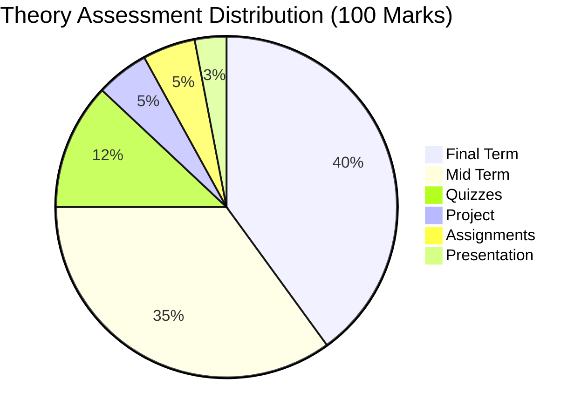
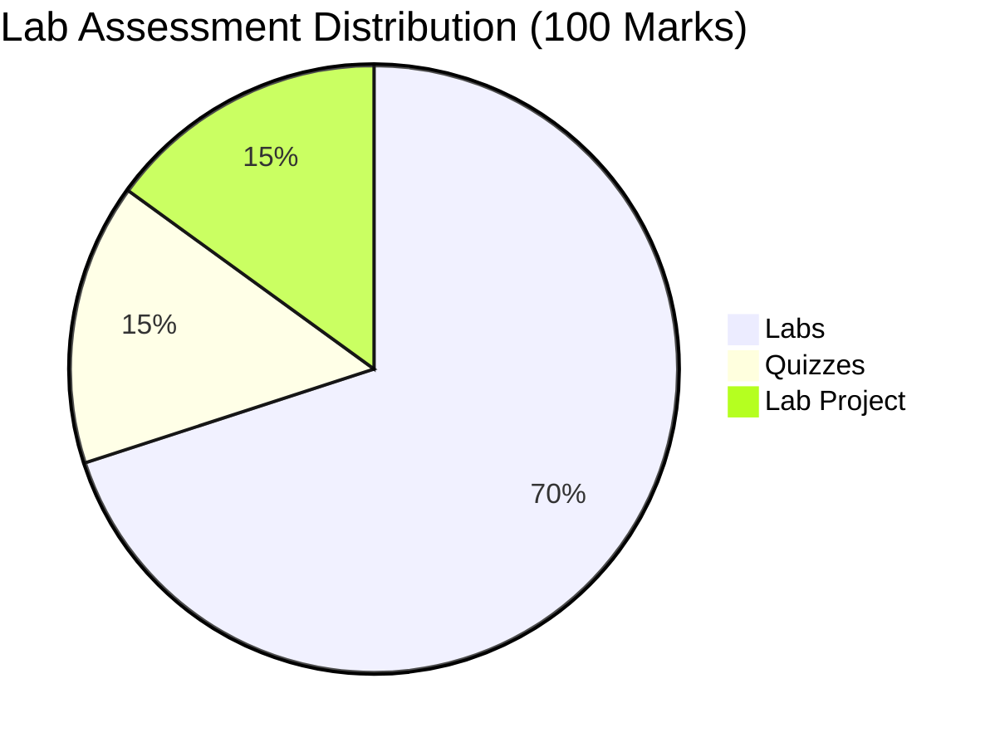
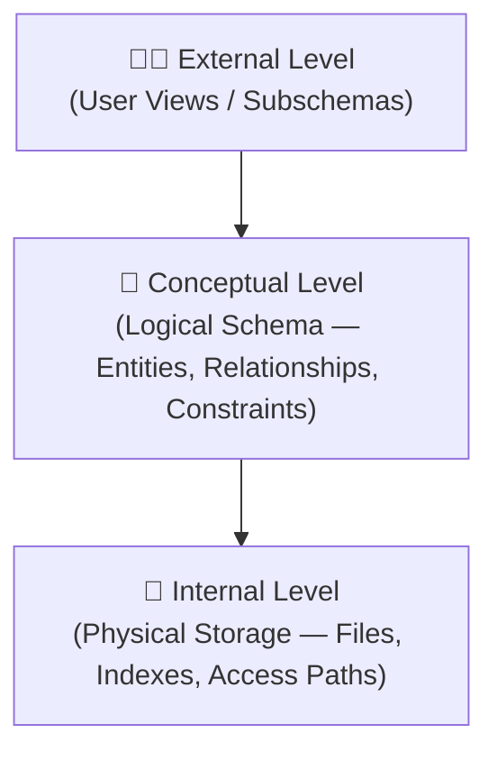
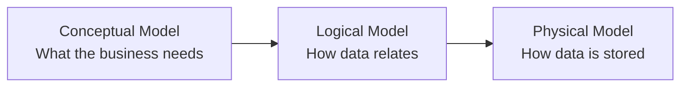
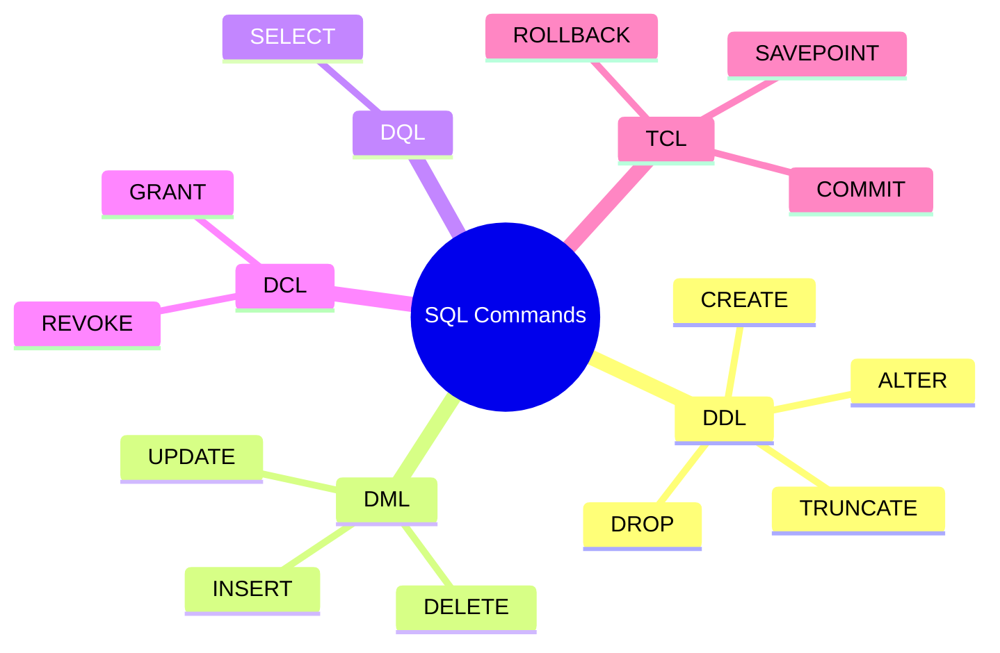
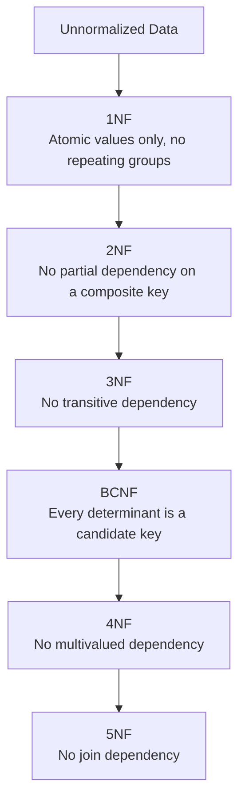
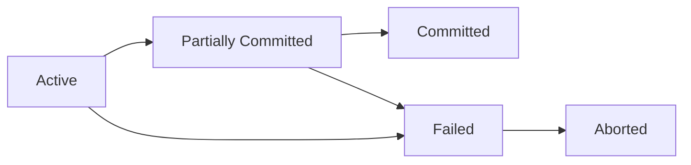
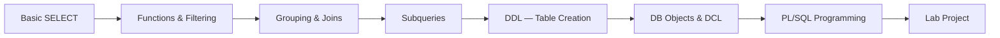

<div align="center">

# 🗄️ Database Management Systems (DBMS)

### *Complete Semester Repository — Theory + Lab*


<br>


</div>

---

# 🎓 University Information

| Item | Details |
|------|---------|
| 🏫 University | University of the Punjab |
| 🏛 Department | Punjab University College of Information Technology (PUCIT) |
| 📚 Subject | Database Management Systems |
| 👨‍🏫 Instructor | Sir Asif |
| 🗓 Semester | 3rd Semester — Fall 2025 |
| 🎯 Degree Program | BS Information Technology |

---

# 📋 Course Information

| Attribute | Theory — CC-215 | Lab — CC-215-L |
|-----------|-----------------|-----------------|
| Course Title | Database Systems | Database Systems Lab |
| Credit Hours | 3 (3,0) | 1 (0,3) |
| Category | Computing Core | Computing Core |
| Prerequisite | None | None |
| Co-Requisite | None | None |
| Follow-up Course | DI-324: Database Administration and Management | DI-324: Database Administration and Management |

---

# 📂 Repository Structure

```
📦 DBMS-Semester-3-Sir-Asif
 ┣ 📁 Books
 ┃ ┣ 📘 Database Systems - Design, Implementation & Management — Coronel & Morris (13th Ed.)
 ┃ ┣ 📗 Database Systems - A Practical Approach to Design, Implementation & Management — Connolly & Begg (6th Ed.)
 ┃ ┗ 📙 Modern Database Management — Hoffer, Venkataraman & Topi (12th Ed.)
 ┃
 ┣ 📁 Course Description
 ┃ ┗ 📄 CC-215 Database Systems — Official Course Outline
 ┃
 ┣ 📁 Labs Description
 ┃ ┗ 📄 CC-215-L Database Systems Lab — Official Lab Outline
 ┃
 ┣ 📁 Lecture Slides
 ┃ ┣ 🖥️ Unit 1  — Introduction (Fall 2024)
 ┃ ┣ 🖥️ Unit 2  — Database Architecture & Components (F24)
 ┃ ┣ 🖥️ Unit 3  — Data Models (F25)
 ┃ ┣ 🖥️ Unit 4  — Relational Data Model (F25)
 ┃ ┣ 🖥️ Unit 5  — Relational Algebra (F25)
 ┃ ┣ 🖥️ Unit 6  — Entity Relationship Model (F25)
 ┃ ┣ 🖥️ Unit 7  — Extended ER Model (F25)
 ┃ ┣ 🖥️ Unit 8  — Transforming ERD into Relations (F25)
 ┃ ┣ 🖥️ Unit 9  — Functional Dependencies & Inference Rules (F25)
 ┃ ┣ 🖥️ Unit 10 — Normalization (F25)
 ┃ ┣ 🖥️ Unit 11 — Database Design (F25)
 ┃ ┣ 🖥️ Unit 12 — Transaction Processing (F25)
 ┃ ┗ 🖥️ Unit 13 — Concurrency Control (F25)
 ┃
 ┗ 📁 Labs Data
   ┣ 📄 DBMS Lab Manual
   ┣ 💻 SQL-1  — Introduction
   ┣ 💻 SQL-2  — SELECT Statement
   ┣ 💻 SQL-3  — Functions (F25)
   ┣ 💻 SQL-4  — Group & Analytic Functions (F25)
   ┣ 💻 SQL-5  — Joins (F25)
   ┣ 💻 SQL-6  — Subquery (F25)
   ┣ 💻 SQL-7  — DDL (F25)
   ┣ 💻 SQL-8  — DDL Continued (F25)
   ┣ 💻 SQL-9  — Database Objects (F25)
   ┣ 💻 SQL-10 — DCL (F25)
   ┣ ⚙️ PL/SQL-1 (F25)
   ┗ ⚙️ PL/SQL-2 (F25)
```

---

# 📑 Table of Contents

- [About This Repository](#-about-this-repository)
- [Reference Books](#-reference-books)
- [Course Learning Outcomes](#-course-learning-outcomes-clos)
- [Assessment Plan](#-assessment-plan)
- [Full Theory Syllabus Explained](#-full-theory-syllabus-explained)
- [16-Week Course Roadmap](#-16-week-course-roadmap)
- [Full Lab Manual Explained](#-full-lab-manual-explained)
- [Key Concepts — Deep Dive](#-key-concepts--deep-dive)
- [How to Use This Repository](#-how-to-use-this-repository)
- [Technologies & Concepts Covered](#-technologies--concepts-covered)
- [Author](#-author)
- [License](#-license)
- [Acknowledgements](#-acknowledgements)

---

# 📖 About This Repository

> This repository is a complete, organized archive of my **3rd Semester Database Management Systems (CC-215 / CC-215-L)** course, taught by **Sir Asif** at **PUCIT, University of the Punjab**.

It brings together everything from the semester in one place:

- 📚 All **reference textbooks**
- 📄 Official **course & lab outlines**
- 🖥️ Every **lecture slide deck** (Units 1–13)
- 💻 The complete **SQL & PL/SQL lab manual**

The goal is to make revision, interview preparation, and future reference fast — instead of digging through scattered downloads and WhatsApp groups every exam season.

---

# 📚 Reference Books

| # | Book | Author(s) | Edition | ISBN |
|---|------|-----------|---------|------|
| 1️⃣ | Database Systems — Design, Implementation & Management | Carlos Coronel, Steven Morris | 13th Edition | 978-1-337-62790-0 |
| 2️⃣ | Database Systems: A Practical Approach to Design, Implementation & Management | Thomas Connolly, Carolyn Begg | 6th Edition | 1292061189 |
| 3️⃣ | Modern Database Management | Jeffrey A. Hoffer, Ramesh Venkataraman, Heikki Topi | 12th Edition (Pearson, 2015) | 0133544613 |

<p align="center">


</p>

### 📖 What each book is best for

| Book | Best Used For |
|------|----------------|
| Coronel & Morris | Core theory, ER modeling, normalization walkthroughs, end-of-chapter practice problems |
| Connolly & Begg | Deep dives into relational algebra, distributed databases, and database design methodology |
| Hoffer, Venkataraman & Topi | Business-oriented explanations, real organizational case studies, data modeling for management |

---

# 🎯 Course Learning Outcomes (CLOs)

### 📘 Theory (CC-215)

| CLO | Outcome | Bloom's Taxonomy |
|-----|---------|-------------------|
| CLO1 | Understand and explain fundamental database concepts | C2 – Understand |
| CLO2 | Analyze and design conceptual, logical, and physical database schemas using different data models | C4 – Analysis |
| CLO3 | Learn SQL and the fundamentals of PL/SQL | C3 – Apply |
| CLO4 | Design and evaluate a database system for small business organizations | C6 – Create |

### 🧪 Lab (CC-215-L)

| CLO | Outcome | Bloom's Taxonomy |
|-----|---------|-------------------|
| CLO1 | Build a basic understanding of SQL commands and PL/SQL fundamentals | C2 – Understand |
| CLO2 | Write queries as per given requirements | C3 – Apply |
| CLO3 | Evaluate query processing | C5 – Evaluate |

---

# 📊 Assessment Plan

### Theory Weightage



### Lab Weightage



---

# 🗂️ Full Theory Syllabus Explained

## 1️⃣ Introduction to Databases

Covers the difference between **raw data** and **information**, why file-processing systems (flat files managed directly by applications) run into redundancy and consistency problems, and how a **DBMS** solves this by centralizing data management. Also introduces the major categories of databases — relational, hierarchical, network, and NoSQL.

## 2️⃣ Database Architecture & Components

Introduces the **ANSI-SPARC Three-Level Architecture** — the standard way a DBMS separates *how users see data* from *how it's actually stored*.



Also covers **data independence** (logical & physical), the components of a database environment (hardware, software, data, procedures, people), and the different roles of database users — DBA, application programmers, and end users.

## 3️⃣ Data Models

Explains the three stages a real-world requirement passes through before it becomes a working database:



## 4️⃣ Relational Data Model

Core vocabulary of relational databases: **relations (tables)**, **tuples (rows)**, **attributes (columns)**, and **domains**. Covers the different types of keys:

| Key Type | Purpose |
|----------|---------|
| Super Key | Any attribute set that uniquely identifies a tuple |
| Candidate Key | A minimal super key |
| Primary Key | The chosen candidate key for the table |
| Foreign Key | An attribute referencing another table's primary key |
| Composite Key | A key made of more than one attribute |

Also covers **integrity constraints** — Entity Integrity (no null primary keys) and Referential Integrity (foreign keys must match an existing primary key or be null).

## 5️⃣ Relational Algebra

The formal, mathematical query language behind SQL. Key operators: **Selection (σ)** — filters rows, **Projection (π)** — filters columns, **Cartesian Product (×)**, **Union**, **Set Difference**, and the different **Join** operators.

## 6️⃣ Structured Query Language (SQL)

The single biggest chunk of the course. SQL commands are grouped into five categories:



Also covers **single-row functions** (character, number, date, conversion), **group/analytic functions** (SUM, AVG, COUNT, ROLLUP, CUBE), all **join types**, **subqueries**, and database objects — **Views, Indexes, Sequences, Synonyms**.

## 7️⃣ Entity Relationship (ER) Model

The blueprint stage of database design. Covers entities, attribute types (simple, composite, multivalued, derived), relationships, **cardinality** (1:1, 1:M, M:N), **participation** (total vs. partial), and the **degree** of a relationship (unary, binary, ternary).

## 8️⃣ Enhanced Entity Relationship (EER) Model

Extends basic ER modeling with **specialization and generalization** — modeling entity supertypes and subtypes (e.g., an `Employee` entity specialized into `Manager` and `Technician`), similar to inheritance in programming.

## 9️⃣ Transforming ERD into Relational Schema

The rulebook for converting an ER diagram into actual database tables — how 1:1, 1:M, and M:N relationships each become foreign keys or junction tables, and how multivalued/composite attributes get flattened into separate columns or tables.

## 🔟 Functional Dependencies & Normalization

A **functional dependency** (X → Y) means the value of X determines the value of Y. **Armstrong's Axioms** (Reflexivity, Augmentation, Transitivity) are the formal inference rules used to derive all dependencies in a relation — the mathematical foundation for normalization.



Normalization exists to eliminate **insertion, update, and deletion anomalies** caused by redundant data.

## 1️⃣1️⃣ Database Design

Compares **top-down design** (start broad, refine into detail) with **bottom-up design** (start with individual attributes, group them into entities), and walks through the three design phases — conceptual, logical, physical — plus strategies for improving performance (indexing, selective denormalization).

## 1️⃣2️⃣ Transaction Management

A **transaction** is a single logical unit of work that must complete entirely or not at all. Governed by the **ACID** properties:

| Property | Meaning |
|----------|---------|
| **A**tomicity | All operations succeed, or none do |
| **C**onsistency | The database moves from one valid state to another |
| **I**solation | Concurrent transactions don't interfere with each other |
| **D**urability | Once committed, changes survive system failure |



Also covers **recovery techniques** for restoring a consistent database state after failure (log-based recovery, checkpoints).

## 1️⃣3️⃣ Concurrency Control

Addresses what goes wrong when multiple transactions run at the same time: **lost updates**, **dirty reads (uncommitted data)**, and **inconsistent retrievals**. Solved using **locking** (shared vs. exclusive locks, two-phase locking), **timestamp ordering**, and **deadlock** detection/prevention.

## 1️⃣4️⃣ Distributed DBMS

A database spread across multiple physical sites that behaves like a single system. Covers the components of a DDBMS and the **transparency features** that hide the distribution from users — location transparency, fragmentation transparency, and replication transparency.

## 1️⃣5️⃣ Advancements: NoSQL, Big Data & Future Trends

Introduces **NoSQL** database categories (document, key-value, column-family, graph) as an alternative to relational databases for large-scale, flexible-schema data, plus a look at **data quality** and **data integration** challenges in modern systems.

## 1️⃣6️⃣ Procedural SQL (PL/SQL)

Oracle's procedural extension to SQL, covering the structure of a **PL/SQL block** (`DECLARE` / `BEGIN` / `EXCEPTION` / `END`), variables, control structures (`IF`, loops), **cursors**, **stored procedures and functions**, and **database triggers**.

---

# 🗓️ 16-Week Course Roadmap

| Week | Core Topics | Milestone |
|------|-------------|-----------|
| 1 | Introduction to Databases; Basic SQL SELECT & operators | — |
| 2 | Database Architecture (3-level schema); SELECT refinements (DISTINCT, ORDER BY) | Term Project initiated |
| 3 | Data Modeling basics; Single-row SQL functions (character) | Quiz #1 · Project proposal due |
| 4 | Logical Data Models & Relational Keys; Number/Date functions | — |
| 5 | Relational Algebra; Group functions & Analytic functions | Assignment #1 |
| 6 | ER Modeling fundamentals; SQL Joins | Quiz #2 |
| 7 | Enhanced ER Model; Subqueries | Preliminary project report due |
| 8 | Creating tables & constraints; Transform ERD → relational schema | — |
| 9 | Data manipulation (INSERT/UPDATE/DELETE); Normalization intro | — |
| 10 | Normalization (1NF–3NF); Views, Indexes, Sequences | **Mid Term Exam** |
| 11 | Higher normal forms (BCNF, 4NF, 5NF); DCL (GRANT/REVOKE) | Quiz #3 · Revised ER model due |
| 12 | Database Design strategies; Transaction Management | Assignment #2 |
| 13 | Concurrency Control; PL/SQL basics | Presentations · Quiz #4 |
| 14 | Concurrency (locking, deadlocks); PL/SQL control structures & cursors | Assignment #3 |
| 15 | Distributed Databases; PL/SQL functions & procedures | Term project submission |
| 16 | Big Data & NoSQL; PL/SQL Triggers; Revision | Quiz #5–6 · **Final Exam prep** |

---

# 🧪 Full Lab Manual Explained

The lab component (CC-215-L) is entirely hands-on SQL and PL/SQL practice, building up from basic queries to full procedural programming.

| Lab Doc | Focus Area | What It Covers |
|---------|------------|-----------------|
| **SQL-1: Introduction** | Environment setup | Installing Oracle/SQL Server, running your first SQL statements |
| **SQL-2: SELECT** | Data retrieval | WHERE clause, comparison & logical operators, `BETWEEN`, `IN`, `LIKE`, `IS NULL`, `DISTINCT`, `ORDER BY` |
| **SQL-3: Functions** | Single-row functions | Character functions, `NVL`/`NVL2` for handling NULLs |
| **SQL-4: Group & Analytic Functions** | Aggregation | `GROUP BY`, `HAVING`, `ROLLUP`, `CUBE`, analytic/window functions |
| **SQL-5: Joins** | Combining tables | Cartesian, Equi/Inner, Outer (Left/Right/Full), Non-equi, Self joins |
| **SQL-6: Subquery** | Nested queries | Single-row & multi-row subqueries, correlated subqueries, `IN`/`ANY`/`ALL` |
| **SQL-7 & SQL-8: DDL** | Schema definition | `CREATE TABLE`, constraints (`PRIMARY KEY`, `FOREIGN KEY`, `UNIQUE`, `CHECK`, `DEFAULT`), `ALTER`, `DROP`, `TRUNCATE`, `RENAME` |
| **SQL-9: Database Objects** | Virtual structures | Views, Indexes, Sequences, Synonyms |
| **SQL-10: DCL** | Access control | Creating users, roles, privileges, `GRANT`/`REVOKE` |
| **PL/SQL-1** | Procedural basics | PL/SQL block structure, variable declaration, `SELECT` inside PL/SQL, control structures |
| **PL/SQL-2** | Advanced procedural SQL | Stored procedures, functions, cursors, exception handling, database triggers |

### 🔄 Lab Progression Flow



---

# 🔑 Key Concepts — Deep Dive

### ⚖️ Types of SQL Joins

| Join Type | Returns |
|-----------|---------|
| Inner / Equi Join | Only matching rows from both tables |
| Left Outer Join | All rows from left table + matches from right |
| Right Outer Join | All rows from right table + matches from left |
| Full Outer Join | All rows from both, matched where possible |
| Self Join | A table joined with itself |
| Cartesian Join | Every row of one table paired with every row of the other |

### 🔐 ACID Properties Recap

| Property | Guarantees |
|----------|-----------|
| Atomicity | "All or nothing" execution |
| Consistency | Valid state → valid state |
| Isolation | Transactions don't see each other's uncommitted work |
| Durability | Committed data survives crashes |

### ⚠️ Concurrency Control Problems

| Problem | Description |
|---------|-------------|
| Lost Update | Two transactions overwrite each other's changes |
| Dirty Read | Reading uncommitted data from another transaction |
| Inconsistent Retrieval | Reading data mid-update, getting a partial/inconsistent view |

### 🏗️ Entity Relationship Notations

| Symbol Concept | Represents |
|-----------------|-----------|
| Rectangle | Entity |
| Oval | Attribute |
| Diamond | Relationship |
| Double Oval | Multivalued Attribute |
| Dashed Oval | Derived Attribute |

---

# 🧭 How to Use This Repository

```text
New to the course?
        │
        ▼
Read the Course Description + Lab Description
        │
        ▼
Skim Lecture Slides Unit 1 → Unit 13 in order
        │
        ▼
Practice with the corresponding SQL / PL-SQL lab file
        │
        ▼
Use the Books for deeper theory + practice problems
        │
        ▼
Revisit this README before Quizzes, Midterm & Final
```

---

# 🛠 Technologies & Concepts Covered

<p align="center">


</p>

---

<div align="center">

# ⭐ Repository Completed Successfully ⭐

### *Database Management Systems — CC-215 / CC-215-L*

**Semester 3 · Fall 2025**

---

**Compiled as a Personal Academic Archive**

**Punjab University College of Information Technology (PUCIT)**

---

# 📜 License

This repository is intended for **educational purposes only**. All textbooks remain the intellectual property of their respective authors and publishers, and are shared here solely for personal academic reference within this course. You are free to study, reference, and learn from the original material (lecture slides, lab manuals) for non-commercial purposes — please credit this repository if you reuse substantial parts of it.

---

# 🙏 Acknowledgements

Special thanks to:

- **Sir Asif** — for his teaching throughout the Database Systems course
- PUCIT Faculty & Lab Instructors
- Classmates who helped clarify concepts during lab sessions
- Everyone who provided feedback while building this repository

---

# 👨‍💻 Author

## Talha Yaseen

*Roll: BITF24M041*

*BS Information Technology*

Database Management Systems — Semester 3

2026

### Connect with Me

- 🌐 GitHub: **[github.com/Talha-Yaseen-Hub](https://github.com/Talha-Yaseen-Hub)**
- 💼 LinkedIn: **[linkedin.com/in/talha-yaseen](https://www.linkedin.com/in/talha-yaseen-44a41a341)**
- 📧 Email: **talhavectorarts@gmail.com**

---

# ⭐ Support the Repository

If this repository helped you revise for your DBMS course or organize your own semester notes, consider giving it a ⭐ Star on GitHub.

Your support motivates me to keep building and sharing organized academic resources.

---

# ❤️ Thank You for Visiting

### 🌟 "A well-designed database doesn't just store data — it protects its integrity, one constraint at a time."

---

<br>


</div>
